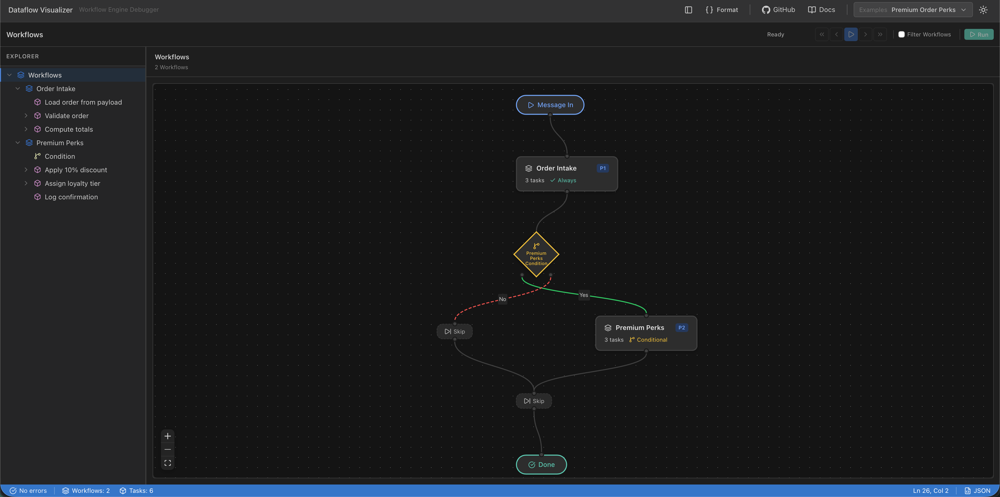
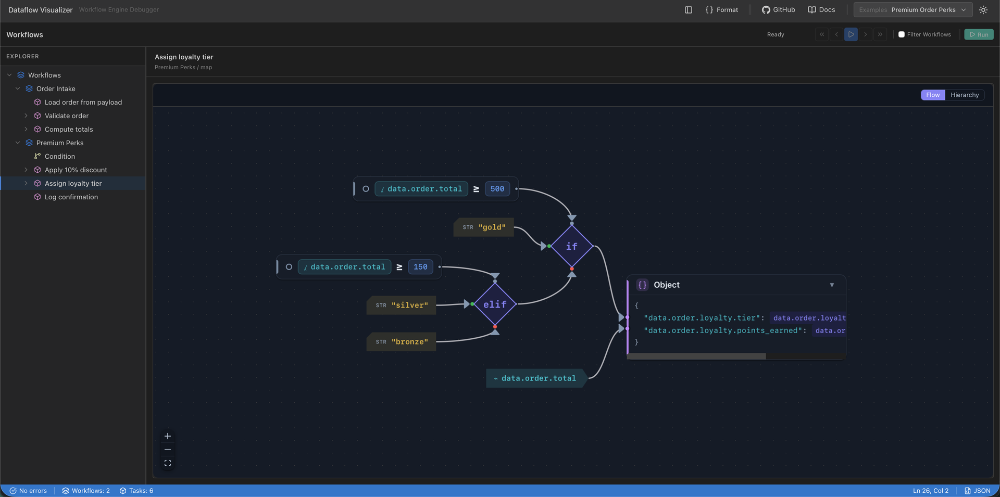

<div align="center">
  

  # Dataflow-rs

  **A high-performance rules engine for IFTTT-style automation in Rust with zero-overhead JSONLogic evaluation.**

  [](https://github.com/GoPlasmatic/dataflow-rs/actions/workflows/ci.yml)
  [](https://opensource.org/licenses/Apache-2.0)
  [](https://www.rust-lang.org)
  [](https://crates.io/crates/dataflow-rs)
  [](https://docs.rs/dataflow-rs)
  [](https://crates.io/crates/dataflow-rs)
</div>

---

<div align="center">
  <a href="https://goplasmatic.github.io/dataflow-rs/debugger/">
    
  </a>
  <p><em>Two chained rules in the visual debugger — <strong>IF</strong> the condition matches, <strong>THEN</strong> the next rule runs. <a href="https://goplasmatic.github.io/dataflow-rs/debugger/">Try it live in your browser →</a></em></p>
</div>

Dataflow-rs is a lightweight, embeddable rules engine that lets you define **IF → THEN → THAT** automation in JSON. Rules are evaluated using pre-compiled JSONLogic for zero runtime overhead, and actions execute asynchronously for high throughput. Whether you're routing events, validating data, or building complex automation pipelines, Dataflow-rs gives you enterprise-grade performance with minimal complexity.

### ⚡ Blazing Fast Performance
Dataflow-rs is built for high-throughput hot paths. By compiling all JSONLogic expressions once at engine startup, runtime evaluation runs with zero allocations, zero parsing overhead, and predictable latency. 

A multi-threaded benchmark (1,000,000 concurrent events) on a 10-core Apple M2 Pro yields:
*   **Throughput:** **~630,000 messages/sec**
*   **Median (P50) Latency:** **6 μs**
*   **Tail (P99) Latency:** **52 μs**
*   **Tail (P99.9) Latency:** **94 μs**

### 🧩 Full-Stack Ecosystem
Go beyond backend microservices. Use the same rule definitions across your entire stack:
1.  **Rust Backend:** Run natively with maximum speed and concurrency using `dataflow-rs`.
2.  **Browser & Edge:** Run client-side validations or edge routing using WebAssembly bindings via [@goplasmatic/dataflow-wasm](https://www.npmjs.com/package/@goplasmatic/dataflow-wasm).
3.  **React UI Admin Portal:** Let users and developers visualize, edit, and step-by-step debug rules using [@goplasmatic/dataflow-ui](https://www.npmjs.com/package/@goplasmatic/dataflow-ui).

## How It Works: IF → THEN → THAT

```text
┌─────────────────────────────────────────────────────────────────┐
│  Rule (Workflow)                                                │
│                                                                 │
│  IF    condition matches        →  JSONLogic against any field  │
│  THEN  execute actions (tasks)  →  map, validate, custom logic  │
│  THAT  chain more rules         →  priority-ordered execution   │
└─────────────────────────────────────────────────────────────────┘
```

**Example:** IF `order.total > 1000` THEN `apply_discount` AND `notify_manager`

## Core Concepts

| Rules Engine | Workflow Engine | Description |
|---|---|---|
| **Rule** | **Workflow** | A condition + actions bundle — IF condition THEN execute actions |
| **Action** | **Task** | An individual processing step (map, validate, or custom function) |
| **RulesEngine** | **Engine** | Evaluates rules against messages and executes matching actions |

Both naming conventions are fully supported — use whichever fits your mental model.

## Why dataflow-rs?

If you need dynamic business rules or user-customizable workflows, writing manual `if/else` checks makes your code rigid, while running full orchestrators (like Temporal or Zeebe) adds heavy infrastructure overhead and milliseconds of network latency. Dataflow-rs gives you the best of both worlds:

| Capability | Hardcoded Rust | dataflow-rs | Heavy Orchestrators (Temporal/Zeebe) |
|---|---|---|---|
| **Hot Reload Rules** | Recompile & redeploy | **Instant JSON update** | Deploy new worker code |
| **Execution Overhead** | None | **Zero (pre-compiled JSONLogic)** | DB reads/writes (tens of ms) |
| **Browser Execution** | Compile full app to WASM | **Run same rules in JS via WASM** | Network round-trip required |
| **Visual Debugger** | Build your own UI | **Included React UI components** | Included dashboard |
| **Infrastructure** | None | **None (embeddable library)** | Requires server clusters & DBs |

## Getting Started

### 1. Add to `Cargo.toml`

```toml
[dependencies]
dataflow-rs = "3.11"
tokio = { version = "1", features = ["rt-multi-thread", "macros"] }
serde_json = "1.0"
```

JSONLogic's extended operator families are opt-in — the default build ships core
JSONLogic only. Add the families your rules use:

```toml
[dependencies]
dataflow-rs = { version = "3.11", features = ["ext-string", "ext-control"] }
```

Read [JSONLogic → Operator Families](docs/src/advanced/jsonlogic.md#operator-families-cargo-features)
first: enabling a family can change how an existing rule behaves.

### 2. Define Rules in JSON

A message arrives with its body in `payload`. Conditions and mappings are
evaluated against `data`, so the first rule loads the payload into `data`, and
the second rule acts on it. This is the **chaining** in IF → THEN → THAT: rules
run in order, and each one sees what the previous rules wrote.

```json
{
    "id": "order_intake",
    "name": "Order Intake",
    "tasks": [
        {
            "id": "load_order",
            "name": "Load payload into data.order",
            "function": {
                "name": "parse_json",
                "input": {"source": "payload", "target": "order"}
            }
        }
    ]
}
```

```json
{
    "id": "premium_order",
    "name": "Premium Order Processing",
    "condition": {">=": [{"var": "data.order.total"}, 1000]},
    "tasks": [
        {
            "id": "apply_discount",
            "name": "Apply Premium Discount",
            "function": {
                "name": "map",
                "input": {
                    "mappings": [
                        {
                            "path": "data.order.discount",
                            "logic": {"*": [{"var": "data.order.total"}, 0.1]}
                        },
                        {
                            "path": "data.order.final_total",
                            "logic": {"-": [{"var": "data.order.total"}, {"*": [{"var": "data.order.total"}, 0.1]}]}
                        }
                    ]
                }
            }
        }
    ]
}
```

> **A rule's condition is evaluated before any of its own tasks run.** A
> condition can only read what earlier rules produced — never what its own tasks
> are about to write. That is why the parse lives in its own rule here rather
> than as a first task on `premium_order`.

### 3. Run the Engine

```rust
use dataflow_rs::{Engine, Workflow};
use dataflow_rs::engine::message::Message;
use serde_json::json;

#[tokio::main]
async fn main() -> Result<(), Box<dyn std::error::Error>> {
    // Rule 1 from Step 2 — always runs, moves the payload into `data.order`.
    let intake = Workflow::from_json(r#"{
        "id": "order_intake",
        "name": "Order Intake",
        "tasks": [
            {
                "id": "load_order",
                "name": "Load payload into data.order",
                "function": {
                    "name": "parse_json",
                    "input": {"source": "payload", "target": "order"}
                }
            }
        ]
    }"#)?;

    // Rule 2 from Step 2 — runs only when the condition matches.
    let premium = Workflow::from_json(r#"{
        "id": "premium_order",
        "name": "Premium Order Processing",
        "condition": {">=": [{"var": "data.order.total"}, 1000]},
        "tasks": [
            {
                "id": "apply_discount",
                "name": "Apply Premium Discount",
                "function": {
                    "name": "map",
                    "input": {
                        "mappings": [
                            {
                                "path": "data.order.discount",
                                "logic": {"*": [{"var": "data.order.total"}, 0.1]}
                            },
                            {
                                "path": "data.order.final_total",
                                "logic": {"-": [{"var": "data.order.total"}, {"*": [{"var": "data.order.total"}, 0.1]}]}
                            }
                        ]
                    }
                }
            }
        ]
    }"#)?;

    // Create engine — all JSONLogic compiled once here
    let engine = Engine::builder()
        .with_workflows(vec![intake, premium])
        .build()?;

    // Process a message. `from_value` sets the *payload*; `parse_json` in the
    // first rule is what lands it in `data`.
    let mut message = Message::from_value(&json!({"total": 1500}));
    engine.process_message(&mut message).await?;

    assert_eq!(message.data()["order"]["discount"].as_f64(), Some(150.0));
    assert_eq!(message.data()["order"]["final_total"].as_f64(), Some(1350.0));

    println!("Discount: {}", message.data()["order"]["discount"]); // 150
    println!("Final Total: {}", message.data()["order"]["final_total"]); // 1350
    Ok(())
}
```

### Handling Errors — Two Channels

`process_message` reports errors through **two complementary channels**:

- `Result::Err` signals that the engine **stopped early** (a task failed without
  `continue_on_error`, or an engine-level error occurred).
- `message.errors()` **always** contains every error encountered, including
  errors from tasks that ran with `continue_on_error = true` and so didn't
  short-circuit the workflow.

A short-circuit `?` will surface only the first kind. For full coverage:

```rust,no_run
use dataflow_rs::{Engine, Workflow};
use dataflow_rs::engine::message::Message;
use serde_json::json;

#[tokio::main]
async fn main() -> Result<(), Box<dyn std::error::Error>> {
    let engine = Engine::builder()
        .with_workflow(Workflow::from_json(r#"{ ... }"#)?)
        .build()?;

    let mut message = Message::from_value(&json!({"order": {"total": 1500}}));

    // `continue_on_error` tasks may record errors here without returning Err.
    if let Err(e) = engine.process_message(&mut message).await {
        eprintln!("engine halted: {e}");
    }

    // Always iterate `message.errors()` to see everything that went wrong.
    for err in message.errors() {
        eprintln!(
            "[{workflow_id}/{task_id}] {msg}",
            workflow_id = err.workflow_id.as_deref().unwrap_or("-"),
            task_id = err.task_id.as_deref().unwrap_or("-"),
            msg = err.message,
        );
    }

    Ok(())
}
```

### Branching on Why a Task Failed

Both channels above are host-side. A rule's condition can't reach them — the
JSONLogic context is `data`, `metadata` and `temp_data`, and the error list isn't
in it. Point the engine at a context path and it mirrors each failure's code
there as it happens:

```rust,ignore
let engine = Engine::builder()
    .with_workflows(workflows)
    .with_error_context_path("metadata.errors")
    .build()?;
```

Each record is `{workflow_id, task_id, code, status}`, so a later rule can treat
a transient failure differently from a permanent one:

```json
{"in": [{"var": "metadata.errors.0.code"}, ["TIMEOUT_ERROR", "IO_ERROR"]]}
```

Off unless called, and coverage matches `message.errors()` — handler `Err`s, 5xx
outcomes, every failing `validation` rule, and anything a handler records itself.
The error text and the operator-only `detail` are deliberately left out, since
the context is serialized back to callers. See the
[error handling guide](https://goplasmatic.github.io/dataflow-rs/core-concepts/error-handling.html)
for the full rules.

### Classifying Your Own Errors

The built-in error variants describe engine concerns — a missing function, a
failed condition, a bad path. When a handler fails for a reason only your
service understands (a circuit breaker opened, a tenant hit a rate limit),
classify it yourself instead of inventing a parallel error channel:

```rust,ignore
use dataflow_rs::DataflowError;

DataflowError::service("circuit_open", "upstream unavailable")
    .detail("connector 'billing' breaker open since 12:04")
    .retryable(true)
    .build()
```

`kind` becomes `ErrorInfo::code` verbatim (not upper-cased, so the string your
service writes is the string it switches on), `detail` is an operator-only field
that `Display` never renders — `to_string()` stays safe for an untrusted caller —
and `retryable` is declared rather than inferred from the variant. The engine
never interprets any of it: `continue_on_error`, the audit entry, and the
`Result::Err` short-circuit behave exactly as for any other error.

### Using Rules Engine Aliases

```rust,ignore
use dataflow_rs::{RulesEngine, Rule, Action};

// These are type aliases — same types, rules-engine terminology
let rule = Rule::from_json(r#"{ ... }"#)?;
let engine = RulesEngine::builder().with_workflow(rule).build()?;
```

## Key Features

- **IF → THEN → THAT Model:** Define rules with JSONLogic conditions, execute actions, chain with priority ordering.
- **Zero Runtime Compilation:** All JSONLogic expressions pre-compiled at startup for optimal performance.
- **Full Context Access:** Conditions can access any field — `data`, `metadata`, `temp_data`.
- **Secrets Outside the Record:** `{"secret": "name"}` reads an engine-scoped store that no trace, snapshot or serialized message ever contains — and `build()` refuses a workflow that would copy one into the message.
- **Async-First Architecture:** Native async/await support with Tokio for high-throughput processing.
- **Execution Tracing:** Step-by-step debugging with message snapshots after each action, bounded by `TraceOptions` (snapshot budget, redaction, timings-only mode) when you need it in production.
- **Always-On Observability:** Attach an `ExecutionObserver` for per-task timing, including the sync built-ins a trace or a wrapped handler can't reach on their own.
- **Built-in Functions:** Parse, Map, Validate, Filter, Log, and Publish for complete data pipelines.
- **Pipeline Control Flow:** Filter/gate function to halt workflows or skip tasks based on conditions.
- **Rejecting Assertions:** `halt_on: "failure"` ends a rule once an action has run and failed — the gate a `validation` needs, since `continue_on_error` covers only `5xx` and `Err`. The task keeps its own status (a `400` stays a `400`).
- **Channel Routing:** Route messages to specific workflow channels with O(1) lookup.
- **Traffic Splits:** Roll a new workflow version out to a percentage of a channel's traffic with bucket-range routing.
- **Workflow Lifecycle:** Manage workflow status (active/paused/archived), versioning, and tagging.
- **Hot Reload:** Swap workflows at runtime without re-registering custom functions.
- **Extensible:** Add custom async actions by implementing the `AsyncFunctionHandler` trait, with typed config fields that are themselves JSONLogic (`Template`).
- **Typed Integration Configs:** Pre-validated configs for HTTP, Enrich, and Kafka integrations, with `resolve_*` helpers and an `HttpMethod` enum your client can convert directly.
- **Service-Classified Errors:** Handlers attach their own error `kind`, `detail`, and `retryable` via `DataflowError::Service`, without a parallel error channel.
- **Branch on Why a Task Failed:** Opt in with `with_error_context_path` and the engine mirrors each failure's code into the message context, so a downstream rule can route a timeout differently from a rejected request.
- **WebAssembly Support:** Run rules in the browser with `@goplasmatic/dataflow-wasm`.
- **React UI Components:** Visualize and debug rules with `@goplasmatic/dataflow-ui`.
- **Auditing:** Full audit trail of all changes as data flows through the pipeline.

## Architecture

### Compilation Phase (Startup)
1. All JSONLogic expressions compiled once when the Engine is created
2. Compiled logic cached with Arc for zero-copy sharing
3. Validates all expressions early, failing fast on errors

### Execution Phase (Runtime)
1. **Engine** evaluates each rule's condition against the message context
2. Matching rules execute their actions with pre-compiled logic (zero compilation overhead)
3. `process_message()` for normal execution, `process_message_with_trace()` for debugging
4. Each action can be async, enabling I/O operations without blocking
5. Optionally attach an `ExecutionObserver` for always-on per-task timing, or call `process_message_with_trace_options()` for a bounded, redactable trace

## Performance

On a 10-core Apple M2 Pro processing **1,000,000 messages** concurrently (Tokio multi-threaded runtime, `--release`; per message: 1 parse + 6 mappings + 3 validations). Medians of 12 interleaved runs:

| Metric | Value |
|---|---|
| **Throughput** | ~630,000 msg/sec |
| **Avg Latency** | 10 μs |
| **P50 Latency** | 6 μs |
| **P90 Latency** | 19 μs |
| **P95 Latency** | 29 μs |
| **P99 Latency** | 52 μs |
| **P99.9 Latency** | 94 μs |

**Why it's fast:**
- **Pre-Compilation:** All JSONLogic compiled at startup, zero runtime parsing
- **Arc-Wrapped Logic:** Zero-copy sharing of compiled expressions across threads
- **Arena Evaluation:** Consecutive sync tasks evaluate against one bump-arena view of the context; map writes are spliced into it in place instead of re-cloning the written subtree
- **Precomputed Paths:** Mapping, parse, and publish target paths are split and interned at compile time — the hot path never re-parses a path string
- **Async I/O:** Non-blocking operations for external services via Tokio

**Tuning tip:** if you never read audit trails, build messages with
`Message::builder().capture_changes(false)` — skipping the per-mapping
old/new value snapshots is the largest single lever in mapping-heavy
workloads. See the [performance guide](https://goplasmatic.github.io/dataflow-rs/advanced/performance.html) for more.

Run the benchmarks and examples yourself:

```bash
cargo run --example benchmark --release             # Full throughput + latency percentiles
cargo run --example realistic_benchmark --release   # ISO 20022 -> SwiftMT-style workload
cargo run --example micro_aggregate_bench --release # Aggregate-heavy (reduce/map) workload
cargo run --example hello_world           # Minimal getting-started example
cargo run --example rules_engine          # IFTTT-style rules engine demo
cargo run --example complete_workflow     # Parse → Transform → Validate pipeline
cargo run --example custom_function       # Extending the engine with custom handlers
cargo run --example error_handling        # Error handling patterns
cargo run --example async_migration       # Typed Input + TaskContext + TaskOutcome handler shape
```

Targeted microbenchmarks for profiling a specific hot path. The `micro_*` ones
run a tight `current_thread` loop so the signal isn't buried under Tokio
scheduling; the last two measure throughput on a multi-threaded runtime:

```bash
cargo run --example micro_cond_bench --release          # Condition-eval / trivially-true folding
cargo run --example micro_multiworkflow_bench --release # Chained workflows, per-workflow arena cost
cargo run --example micro_subtree_write_bench --release # Same-subtree map-write scaling
cargo run --example async_handler_benchmark --release   # Marginal cost of one custom async handler
cargo run --example map_performance_test --release      # Sequential map mappings
```

## Custom Functions

Extend the engine with your own async actions. Each handler declares a typed
`Input` (deserialized once at engine init), receives a `TaskContext` that
records audit-trail changes automatically, and returns a `TaskOutcome`:

```rust
use async_trait::async_trait;
use dataflow_rs::{AsyncFunctionHandler, Engine, Result, TaskContext, TaskOutcome};
use dataflow_rs::datavalue::OwnedDataValue;
use serde::Deserialize;
use serde_json::json;

/// Typed config for the handler — fails at `Engine::new()` if malformed,
/// not on first message.
#[derive(Deserialize)]
pub struct NotifyInput {
    pub channel: String,
}

pub struct NotifyManager;

#[async_trait]
impl AsyncFunctionHandler for NotifyManager {
    type Input = NotifyInput;

    async fn execute(
        &self,
        ctx: &mut TaskContext<'_>,
        input: &NotifyInput,
    ) -> Result<TaskOutcome> {
        // Your custom async logic here (HTTP calls, DB writes, etc.)
        ctx.set(
            "data.notified_channel",
            OwnedDataValue::from(&json!(input.channel)),
        );
        Ok(TaskOutcome::Success)
    }
}

// Register handlers via the builder. `.register("name", h)` accepts any
// `AsyncFunctionHandler` and boxes it internally.
fn build(workflows: Vec<dataflow_rs::Workflow>) -> dataflow_rs::Result<Engine> {
    Engine::builder()
        .with_workflows(workflows)
        .register("notify_manager", NotifyManager)
        .build()
}
```

Any config field may be authored as JSONLogic — since 3.9 that is how *every*
parameter of every built-in works. Declare it as `Template` and compile it once
via the `compile_input` hook instead of hand-rolling the raw/compiled pair:

```rust,ignore
#[derive(Deserialize)]
struct GreetingInput {
    // Authored in the workflow as JSONLogic: {"cat": ["hello, ", {"var": "data.name"}]}
    greeting: Template,
}

impl AsyncFunctionHandler for GreetingHandler {
    type Input = GreetingInput;

    // Called once per task at build time, right after `parse_input`. The
    // default is a no-op, so a handler with no `Template` field needs no override.
    fn compile_input(input: &mut Self::Input, c: &TemplateCompiler) -> Result<()> {
        input.greeting.compile(c, "greeting")
    }

    // ...
}
```

A malformed expression fails at build time rather than on the first message that
reaches the task, matching this crate's own stance for the built-ins.

One handler *type* registered under several names — a plugin host, say —
overrides the receiver-taking twins `parse_input_with` / `compile_input_with`
instead, so which field is a template can come from per-registration data. See
[One handler type, several registrations](docs/src/advanced/custom-functions.md#one-handler-type-several-registrations).

A JSON literal *is* JSONLogic for itself, so the static spelling an author
already writes — `"data.out"`, `5000` — folds to a constant at build time and is
evaluated once, not per message. The one thing to know is that a single-key
object whose key names an operator is that operator: write `{"$cat": …}` for the
literal object. See
[Literal keys and the `$` escape](docs/src/advanced/jsonlogic.md#literal-keys-and-the--escape).

## Built-in Functions

| Function | Purpose | Modifies Data |
|----------|---------|---------------|
| `parse_json` | Parse JSON from payload into data context | Yes |
| `parse_xml` | Parse XML string into JSON data structure | Yes |
| `map` | Data transformation using JSONLogic | Yes |
| `validation` | Rule-based data validation | No (read-only) |
| `filter` | Pipeline control flow — halt workflow or skip task | No |
| `log` | Structured logging with JSONLogic expressions | No |
| `publish_json` | Serialize data to JSON string | Yes |
| `publish_xml` | Serialize data to XML string | Yes |

### Filter (Pipeline Control Flow)

The `filter` function evaluates a JSONLogic condition and controls pipeline execution:

```json
{
    "function": {
        "name": "filter",
        "input": {
            "condition": {"==": [{"var": "data.status"}, "active"]},
            "on_reject": "halt"
        }
    }
}
```

- `on_reject: "halt"` — stops the entire workflow when the condition is false
- `on_reject: "skip"` — skips just the current task and continues

### Log (Structured Logging)

The `log` function outputs structured log messages using the `log` crate:

```json
{
    "function": {
        "name": "log",
        "input": {
            "level": "info",
            "message": {"cat": ["Processing order ", {"var": "data.order.id"}]},
            "fields": {
                "total": {"var": "data.order.total"},
                "user": {"var": "data.user.name"}
            }
        }
    }
}
```

Log levels: `trace`, `debug`, `info`, `warn`, `error`. Messages and fields support JSONLogic expressions.

## Channel Routing

Route messages to specific workflow channels for efficient O(1) dispatch:

```rust,ignore
// Workflows define their channel
// { "id": "order_rule", "channel": "orders", "status": "active", ... }

// Process only workflows on a specific channel
engine.process_message_for_channel("orders", &mut message).await?;
```

Only `active` workflows are included in channel routing. Workflows default to the `"default"` channel.

## Workflow Lifecycle

Workflows support lifecycle management fields:

```json
{
    "id": "my_rule",
    "channel": "orders",
    "version": 2,
    "status": "active",
    "tags": ["premium", "high-priority"],
    "created_at": "2025-01-15T10:00:00Z",
    "updated_at": "2025-06-01T14:30:00Z",
    "tasks": [...]
}
```

| Field | Type | Default | Description |
|-------|------|---------|-------------|
| `channel` | string | `"default"` | Channel for message routing |
| `version` | number | `1` | Workflow version |
| `status` | string | `"active"` | `active`, `paused`, or `archived` |
| `tags` | array | `[]` | Arbitrary tags for organization |
| `rollout` | object | `null` | Traffic split — `{bucket_start, bucket_end}` over `0..100` |
| `created_at` | datetime | `null` | Creation timestamp (ISO 8601) |
| `updated_at` | datetime | `null` | Last update timestamp (ISO 8601) |

All fields are optional and backward-compatible with existing configurations.

## Traffic Splits (Canary Rollouts)

Give a workflow a slice of its channel's traffic with a half-open bucket range
over `0..100`, so a new version can roll out gradually alongside the old one:

```json
{
    "id": "checkout_v2",
    "channel": "checkout",
    "rollout": { "bucket_start": 0, "bucket_end": 10 },
    "tasks": [...]
}
```

That workflow serves buckets `0..=9` — 10% of traffic. `bucket_start` is
inclusive and `bucket_end` exclusive, so a `{"bucket_start": 10, "bucket_end": 100}`
sibling covers the remaining 90% with no overlap and no gap.

The engine does not derive the bucket — set it per message with whatever policy
is yours (a sticky hash of a user id, a random draw, round-robin):

```rust,ignore
let message = Message::builder().routing_bucket(7).build();
```

A message with no bucket is admitted by every workflow, split or not, so every
caller that predates rollouts — including the WASM entry points, which have no
way to set one — keeps working unchanged. An excluded workflow is skipped
exactly like a false condition: no audit entry, and the gate runs before any
other per-message work.

## Secrets

A signing key or partner token has to be readable by a condition and must never
appear in a trace. `Message.context` cannot express that — everything in it is
recorded — so secrets live in a store on the engine and are read through one
reserved operator:

```rust,ignore
let engine = Engine::builder()
    .with_secrets_json(&json!({ "webhook_token": std::env::var("WEBHOOK_TOKEN")? }))
    .with_workflows(workflows)
    .build()?;
```

```json
{ "condition": { "==": [ { "var": "metadata.headers.x-token" }, { "secret": "webhook_token" } ] } }
```

The value never enters a `Message`, so it cannot appear in anything derived
from one. A `map` mapping or `log` expression that reads a secret is refused at
`build()` (`SECRET_IN_MESSAGE_WRITE`), as is a name the engine does not declare
(`UNKNOWN_SECRET`); derived values such as an HMAC belong in a custom handler
reading the key through a `Template`. See the
[Secrets](https://goplasmatic.github.io/dataflow-rs/advanced/secrets.html) page.

## Engine Hot Reload

Swap workflows at runtime without losing custom function registrations:

```rust,ignore
let new_workflows = vec![Workflow::from_json(r#"{ ... }"#)?];
let new_engine = engine.with_new_workflows(new_workflows);
// Old engine remains valid for in-flight messages
```

## Execution Tracing & Observability

The default `process_message_with_trace()` snapshots the full message after
every step — great for a step debugger, but unbounded in size and quadratic in
task count. `process_message_with_trace_options` bounds capture at the only
point it can be bounded: snapshot size, path redaction, and audit-trail scope
are all set up front, not trimmed afterward.

```rust,ignore
let trace = engine
    .process_message_with_trace_options(&mut message, TraceOptions::timings_only())
    .await?;

for step in &trace.steps {
    if let Some(us) = step.duration_us {
        println!("{}/{:?} took {us}us", step.workflow_id, step.task_id);
    }
}
```

For always-on aggregation instead of a per-request trace, attach an
`ExecutionObserver`. It fires once per dispatched task — including the sync
built-ins (`map`, `validation`, `filter`, `parse_*`, `publish_*`, `log`), which
are dispatched inside the executor and unreachable by a wrapped handler:

```rust,ignore
impl ExecutionObserver for Metrics {
    fn task_finished(&self, event: &TaskEvent<'_>) {
        // Must be cheap and non-blocking — runs synchronously on the executor.
    }
}

let engine = Engine::builder()
    .with_workflow(workflow)
    .with_observer(Arc::new(Metrics::default()))
    .build()?;
```

With neither attached, tracing and observation overhead — including their clock
reads — stay out of the dispatch path entirely.

## Visualize & Debug Rules

Because every rule is plain JSON, the [React UI](https://www.npmjs.com/package/@goplasmatic/dataflow-ui) can render it: JSONLogic expressions become readable flow diagrams, and the debugger steps through execution with a message diff after every task.

<div align="center">
  <a href="https://goplasmatic.github.io/dataflow-rs/debugger/">
    
  </a>
</div>

## Ecosystem

| Package | Description | Install |
|---------|-------------|-------|
| [dataflow-rs](https://crates.io/crates/dataflow-rs) | Async rules engine in Rust (this crate) | `cargo add dataflow-rs` |
| [@goplasmatic/dataflow-wasm](https://www.npmjs.com/package/@goplasmatic/dataflow-wasm) | WebAssembly bindings — run rules in browser or Node.js | `npm i @goplasmatic/dataflow-wasm` |
| [@goplasmatic/dataflow-ui](https://www.npmjs.com/package/@goplasmatic/dataflow-ui) | React components for rule visualization, editing, and step-by-step debugging | `npm i @goplasmatic/dataflow-ui` |
| [datalogic-rs](https://crates.io/crates/datalogic-rs) | JSONLogic compiler/evaluator used internally | `cargo add datalogic-rs` |

📖 **Documentation:** [User Guide & API Reference](https://goplasmatic.github.io/dataflow-rs/) · [Interactive Playground](https://goplasmatic.github.io/dataflow-rs/playground.html) · [Visual Debugger](https://goplasmatic.github.io/dataflow-rs/debugger/)

## Contributing

We welcome contributions! Here's how to get started:

1. **Fork** the repository and clone your fork
2. **Run tests:** `cargo test` to ensure everything passes
3. **Make changes** and add tests for any new features
4. **Run the benchmark** before and after: `cargo run --example benchmark --release`
5. **Submit a pull request** with a clear description of your changes

See the [CHANGELOG](CHANGELOG.md) for recent changes and release history.

## About Plasmatic

Dataflow-rs is developed by the team at [Plasmatic](https://github.com/GoPlasmatic). We're passionate about building open-source tools for data processing and automation.

## License

This project is licensed under the Apache License, Version 2.0. See the [LICENSE](LICENSE) file for more details.
